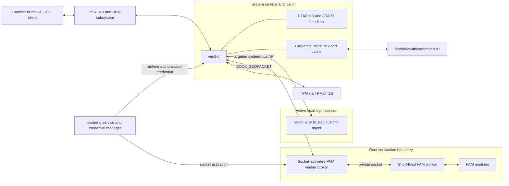
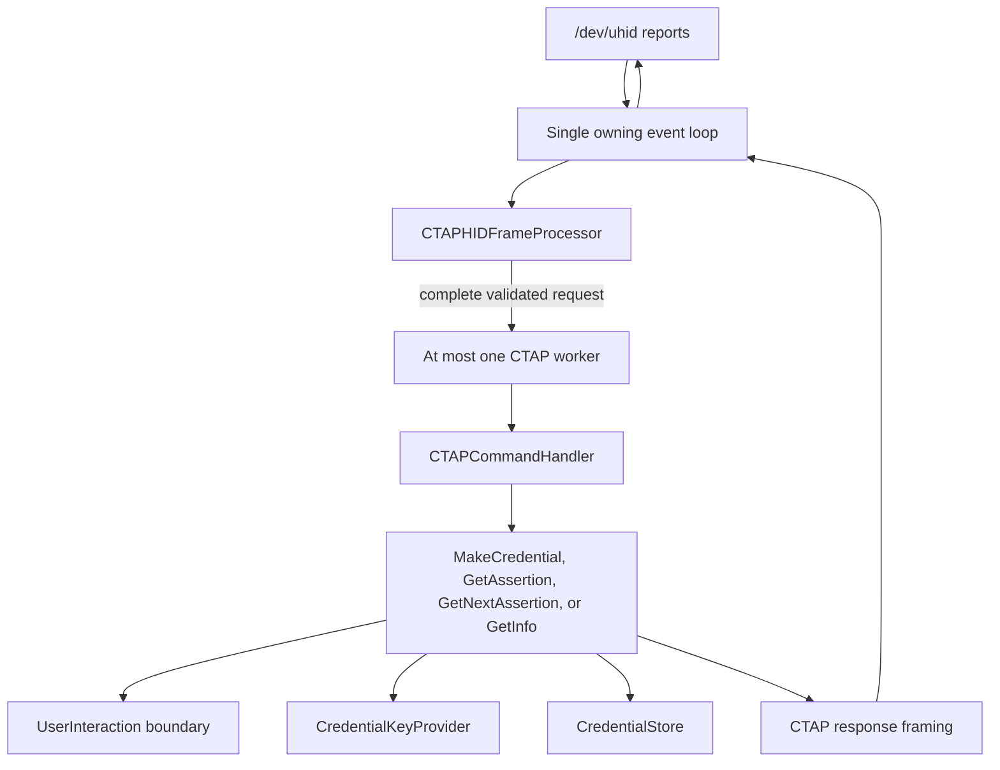
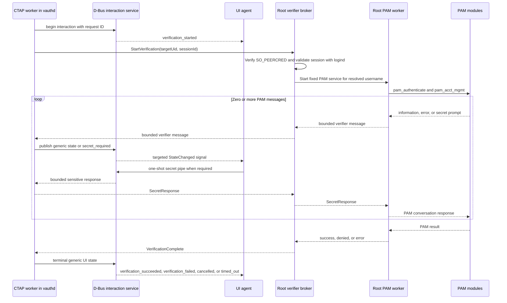
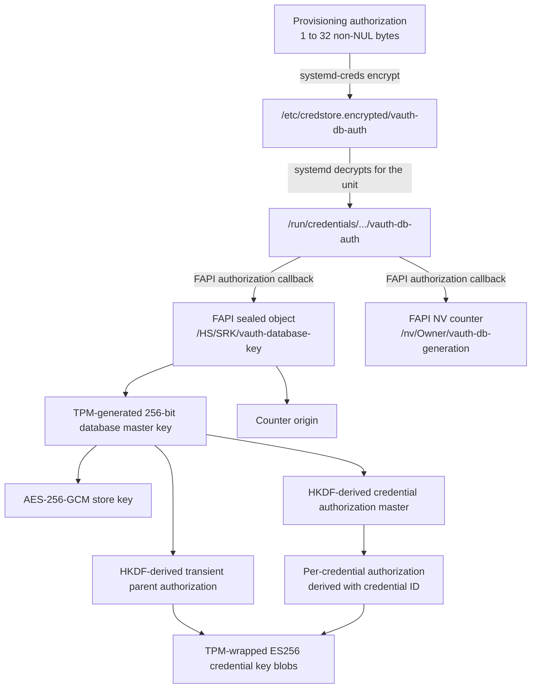
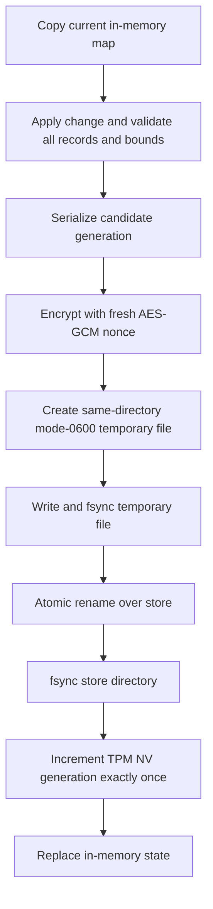
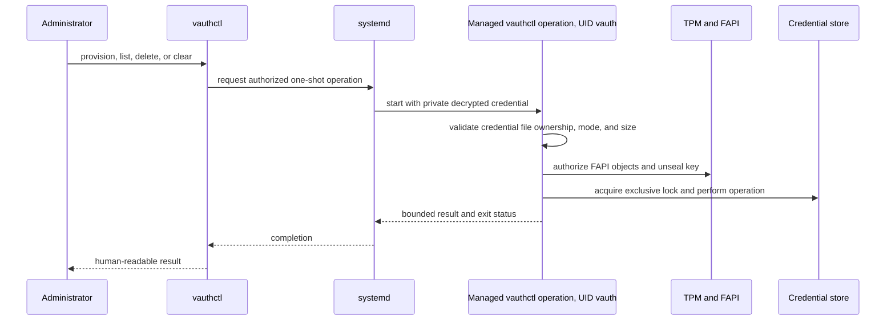

# vAuth architecture

This document describes the target architecture for the public release of
vAuth. It records process boundaries, privilege separation, trust decisions,
key ownership, persistent state, and the main protocol flows. It is not a
replacement for the normative CTAP specification or for the public interaction
agent API.

The normative authenticator protocol is the
[CTAP 2.0 Proposed Standard dated January 30, 2019](https://fidoalliance.org/specs/fido-v2.0-ps-20190130/fido-client-to-authenticator-protocol-v2.0-ps-20190130.html).
The D-Bus interaction protocol is documented in
[`docs/agent-api.md`](docs/agent-api.md).

## Design goals

vAuth is designed around the following boundaries:

- The main daemon processes untrusted CTAPHID and CBOR input without root
  privileges.
- The desktop UI displays requests and transports user responses, but never
  decides whether PAM authentication succeeded.
- PAM runs in a short-lived root process reached through a narrow, bounded
  protocol.
- Credential private keys remain TPM-wrapped. Assertion signing is performed
  by the TPM.
- The credential database is authenticated and encrypted, updated atomically,
  and protected against rollback with a TPM NV counter.
- Production secrets are delivered to narrowly scoped processes rather than
  stored as plaintext command-line arguments, environment variables, or
  ordinary configuration files.
- Every externally visible interaction has explicit ownership, bounded input,
  cancellation, timeout, and terminal states.

## Deployment and privilege boundaries



The installed daemon executable is named `vauthd`; its canonical packaged path
is `/usr/libexec/vauth/vauthd`. The same executable has three internal modes:

| Mode | Identity | Purpose |
|---|---|---|
| `run` | `vauth` service user | UHID device, CTAP processing, D-Bus service, TPM operations, and credential store |
| `pam-verifier` | root, socket-activated | Authenticates the daemon peer, validates the requested login session, and supervises one PAM worker |
| `vauth_auth_handler` | root, child of the broker | Runs the PAM conversation and reports its result |

`vauth-ui` runs as the desktop user. `vauthctl` is a separate administration
program. Neither should be installed setuid.

The executable rename remains release work. The diagrams describe the intended
final state.

## Main daemon data path



The event-loop thread owns the UHID descriptor, allocated channel set, frame
assembler, active-task record, keepalive schedule, and command handler. It
starts at most one long-running CTAP worker. Other channels receive the
appropriate busy response while that worker is active.

The worker observes a stop token throughout user interaction and TPM/storage
work. Completion is handed back under synchronization and joined before the
event loop reads the result or clears assertion-continuation state. A cancelled
operation cannot publish a cached assertion or commit a partially completed
credential operation.

`GetNextAssertion` continuation state belongs to the originating channel. It is
cleared on replacement, exhaustion, timeout where required, cancellation, and
error.

## User presence and verification

Presence and verification are separate authorities:

- The UI agent may approve or deny a user-presence prompt.
- Only PAM may report successful user verification.
- The daemon decides whether the completed ceremony permits the CTAP operation
  and sets the corresponding authenticator-data flags.

### Interaction and PAM sequence



The daemon-to-broker connection uses one Unix `SOCK_SEQPACKET` connection per
verification. The broker obtains the peer identity with `SO_PEERCRED`, requires
the dedicated daemon UID, and validates through logind that the supplied
session exists, is active and local, and belongs to the supplied target UID.
It repeats the session validation before accepting PAM success. The broker
resolves the account name itself and uses fixed PAM service and configuration
values.

The broker remains responsive while PAM blocks. It forwards status and secret
messages, observes daemon cancellation or disconnect, terminates and reaps the
worker, and enforces the overall deadline.

Broker integration tests exercise cancellation during blocking and secret
prompts, timeout, disconnect, malformed and out-of-order messages, callback
failure, worker exit and reaping, and post-PAM session invalidation. An isolated
test PAM module exercises the real PAM conversation callback without consulting
host authentication policy or requiring privileged interaction.

PAM results are interpreted as follows:

| Result | Meaning inside vAuth | CTAP boundary |
|---|---|---|
| `success` | PAM authenticated the account and the trusted context is still current | Continue the operation and set UV when applicable |
| `denied` | PAM made an authoritative negative authentication or account-policy decision | `CTAP2_ERR_OPERATION_DENIED` |
| `error` | PAM, its configuration, the broker, or the verifier protocol failed to produce an authentication decision | `CTAP1_ERR_OTHER` |

The UI deliberately receives a generic failure state for both denial and
infrastructure failure. Detailed diagnostics remain in trusted service logs and
must never include authentication secrets.

## Interaction-agent trust boundary

The D-Bus service derives an agent's unique bus name, PID, UID, account name,
and login session from authenticated operating-system data. Registration is
limited to an active, local, non-remote logind session. One agent is registered
globally, and its bus name plus generation bind every request and response.

The API intentionally permits custom agents. Consequently, every process able
to register from an eligible login session is inside the documented interaction
trust boundary. The daemon does not treat the bundled UI executable as a
special identity.

Secrets cross D-Bus only through a bounded, one-shot pipe descriptor. The UI
must clear its field and buffers after submission. The daemon and verifier use
move-only sensitive buffers and clear them after consumption.

## Security material and key hierarchy

The production systemd credential named `vauth-db-auth` contains the FAPI
authorization value. It is not the database encryption key and it is not a
credential private key.



Provisioning performs these operations:

1. Create the authorized TPM NV rollback counter.
2. Increment it once and record that value as the counter origin.
3. Ask the TPM for a random 256-bit database key.
4. Seal the database key and counter origin together in the authorized FAPI
   seal.
5. Verify that the key can be unsealed and that the logical database generation
   begins at zero.

Both the sealed object and NV counter are created with the same supplied FAPI
authorization. `FapiStoreSecurity` provides that authorization only for the two
known object paths.

At startup, the daemon uses the authorization to unseal the database key. That
key encrypts the store and derives the authorizations protecting the transient
TPM parent and per-credential keys. The authorization is therefore required to
reach the database key, but it does not directly encrypt the database.

The systemd credential mechanism is the selected production delivery method
because it keeps the authorization encrypted at rest and exposes its plaintext
only in the service's private runtime credential directory. A mode-`0400`
authorization file remains available for development and explicit recovery.
Another equally protected secret-delivery mechanism could satisfy the same
cryptographic role; systemd credentials are an operational choice, not a TPM
format requirement.

Loss of either the TPM state or the authorization makes the database and its
credential keys unrecoverable. Recovery material must be handled separately
from the machine.

## Credential persistence and rollback protection

The credential store is `/var/lib/vauth/credentials.v1`. Its directory is
owned by `vauth` with mode `0700`; the file has mode `0600`. A non-blocking
exclusive lock on the directory prevents the daemon and management utility
from opening the store concurrently.

The encrypted envelope contains:

```text
magic || format version || generation || fresh 96-bit nonce || ciphertext || GCM tag
```

The header is authenticated as AES-256-GCM additional data. The decrypted JSON
contains credential metadata and TPM-wrapped private/public blobs; it does not
contain raw credential private keys.

### Durable update



The file is deliberately committed before the NV counter. On startup, a store
generation exactly one ahead of the counter is recognized as an interrupted
commit and the counter is advanced. A store behind the counter is rejected as
a rollback. Other generation mismatches are rejected as inconsistent.

The in-memory map is replaced only after the durable file and counter update
succeed. After an ambiguous counter failure, further writes require a reload so
that crash-recovery rules determine the authoritative state.

## TPM credential keys

Each FIDO credential has an ES256 key created by the TPM under a transient
primary parent. The database stores the TPM private and public blobs. To sign an
assertion, vAuth:

1. Recreates the transient parent using authorization derived from the database
   key.
2. Derives the credential authorization from the database key and credential
   ID.
3. Validates and loads the stored TPM blobs.
4. Asks the TPM to sign the assertion digest.
5. Converts the TPM ECDSA signature to the CTAP/WebAuthn response encoding.

RP ID and owner UID filtering occurs before a credential is selected.
Non-discoverable credentials are considered only when identified by an allow
list; resident discovery returns discoverable credentials only.

## Administration with vauthctl

`vauthctl status` queries systemd and the daemon's read-only D-Bus status API.
It does not need the database authorization.

Provisioning and credential-store commands need the same FAPI authorization as
the daemon. The final production path is a systemd-managed, one-shot invocation
running as the `vauth` service identity with:

- `LoadCredentialEncrypted=vauth-db-auth:...`;
- the TPM access required by FAPI;
- access to `/var/lib/vauth`;
- the same FAPI configuration as the daemon; and
- the daemon stopped, because direct management takes the exclusive store lock.



The exact installed management-unit interface is still release work. For
development and recovery, `--auth-file` explicitly supplies a protected
mode-`0400` file. The encrypted credential file itself must never be passed to
`--auth-file`; it is ciphertext that only systemd should decrypt.

A future daemon management API could allow mutation while the daemon is
running, but it would require privileged authorization and explicit store
synchronization. It is intentionally outside the initial release architecture.

## Installed layout and ownership

The following is the canonical packaged layout. Distribution builds may resolve
the vendor `libexec`, systemd, sysusers, udev, and D-Bus directories through
their build-system variables, but must preserve the same separation of
executables, policy, configuration, and mutable state.

```text
/usr/
├── bin/
│   ├── vauthctl
│   └── vauth-ui
├── libexec/vauth/
│   └── vauthd
├── lib/systemd/system/
│   ├── vauth.service
│   ├── vauth-pam-verifier.socket
│   └── vauth-pam-verifier@.service
├── lib/sysusers.d/
│   └── vauth.conf
├── lib/udev/rules.d/
│   └── 70-vauth.rules
└── share/dbus-1/system.d/
    └── org.lamellix.vAuth.conf

/etc/
├── vauth/config/
│   └── vauth
└── credstore.encrypted/
    └── vauth-db-auth
```

The packaged files have the following roles:

| Path | Ownership and mode | Role |
|---|---|---|
| `/usr/libexec/vauth/vauthd` | `root:root`, mode `0755` | Non-interactive daemon binary and its two internal verifier modes |
| `/usr/bin/vauthctl` | `root:root`, mode `0755`, never setuid | Administrator-facing status and credential-management frontend |
| `/usr/bin/vauth-ui` | `root:root`, mode `0755`, runs as the desktop user | Bundled interaction agent |
| `/usr/lib/systemd/system/vauth.service` | `root:root`, mode `0644` | Long-running unprivileged authenticator unit |
| `/usr/lib/systemd/system/vauth-pam-verifier.socket` | `root:root`, mode `0644` | Root-owned verifier activation socket definition |
| `/usr/lib/systemd/system/vauth-pam-verifier@.service` | `root:root`, mode `0644` | One root broker instance per accepted connection |
| `/usr/lib/sysusers.d/vauth.conf` | `root:root`, mode `0644` | Declares the non-login `vauth` system identity; packaging also grants the required TPM group membership |
| `/usr/lib/udev/rules.d/70-vauth.rules` | `root:root`, mode `0644` | Grants the `vauth` identity access to `/dev/uhid`; systemd device policy remains an additional restriction |
| `/usr/share/dbus-1/system.d/org.lamellix.vAuth.conf` | `root:root`, mode `0644` | Grants the daemon its well-known name and exposes only the documented agent/status methods |
| `/etc/vauth/config/vauth` | root-managed, not writable by `vauth` | Isolated PAM policy selected by the root verifier |
| `/etc/credstore.encrypted/vauth-db-auth` | `root:root`, mode `0600` | Encrypted systemd credential; never passed to vAuth as if it were plaintext |

The debug console agent and test PAM module are development artifacts and are
not installed by a production build. Starting the bundled UI automatically is
a desktop-integration policy choice; the daemon does not start it and continues
to fail closed when no eligible agent has registered.

### Unit topology

```mermaid
flowchart LR
    Manager[systemd system manager]
    Credential[Encrypted vauth-db-auth]
    DaemonUnit[vauth.service<br/>UID vauth]
    Daemon[vauthd run]
    Socket[vauth-pam-verifier.socket<br/>root:vauth 0660]
    BrokerUnit[vauth-pam-verifier@.service<br/>UID root]
    Broker[vauthd pam-verifier]
    Worker[vauthd vauth_auth_handler]

    Credential --> |LoadCredentialEncrypted| Manager
    Manager --> |private runtime credential| DaemonUnit
    DaemonUnit --> Daemon
    Manager --> Socket
    Daemon --> |one SOCK_SEQPACKET connection| Socket
    Socket --> |Accept=yes; accepted descriptor| BrokerUnit
    BrokerUnit --> Broker
    Broker --> |private inherited socket| Worker
```

`vauth.service` is the only long-running system service that consumes the UHID,
TPM, and credential-store resources, and it runs as the dedicated `vauth`
account. The unit requires and is ordered after the verifier socket. The
template verifier service is never enabled directly;
systemd instantiates it for one accepted connection and it exits after that
verification reaches a terminal state. The PAM worker is a child of that
instance, not another independently managed service.

The socket node is `/run/vauth-pam-verifier.sock`, owned by `root:vauth` with
mode `0660`. Filesystem permission is only the first check: the broker also
requires the kernel-reported peer UID to equal the dedicated `vauth` UID. No
general `/run/vauth/` directory is required by this design.

### Persistent and runtime state

| Resource | Owner or consumer | Purpose |
|---|---|---|
| `/var/lib/vauth/` | `vauth:vauth`, mode `0700`, created by `StateDirectory=vauth` | Credential-store directory and the object locked with `flock` |
| `/var/lib/vauth/credentials.v1` | `vauth:vauth`, mode `0600` | Authenticated encrypted credential database |
| Temporary files in `/var/lib/vauth/` | `vauth:vauth`, mode `0600` | Same-directory durable store replacement; removed or renamed before completion |
| `/run/credentials/<unit>/vauth-db-auth` | private to the active unit, managed by systemd | Decrypted authorization presented to the process through `CREDENTIALS_DIRECTORY` |
| `/run/vauth-pam-verifier.sock` | `root:vauth`, mode `0660` | Daemon-to-root-verifier transport |
| `/dev/uhid` | accessible only to `vauth` as required | Virtual HID device creation and reports |
| `/dev/tpmrm0` | accessible to `vauth` and the managed administration operation | Preferred TPM resource-manager transport |
| Configured FAPI system directory | writable only by its designated TPM2-TSS consumer | FAPI object metadata, including the sealed database key and NV-counter metadata |

FAPI object storage remains managed by TPM2-TSS according to the selected FAPI
configuration and its `system_dir`. vAuth does not assume or create a second
keystore under `/var/lib/vauth`. The service sandbox must grant write access to
the configured FAPI directory explicitly. `/dev/tpm0` is granted only on
systems whose TPM2-TSS configuration cannot use `/dev/tpmrm0`.

The daemon has no plaintext authorization-file override. It loads
`vauth-db-auth` only from its systemd credential directory. Explicit
mode-`0400` authorization files remain a `vauthctl` development and recovery
mechanism and are never part of normal daemon startup.

## Failure and cancellation model

- Malformed transport or CTAP input is rejected at the narrowest parsing
  boundary before side effects.
- User denial is distinct from verifier infrastructure failure.
- UI cancellation and CTAPHID cancellation remain observable while PAM blocks.
- Losing the registered D-Bus name, changing login session, or changing agent
  generation invalidates pending interaction state.
- Losing either side of the verifier socket terminates the broker operation and
  its PAM worker.
- Sensitive buffers and TPM/FAPI allocations use RAII and are cleared or freed
  on every exit path.
- No code path falls back to daemon stdin, a terminal prompt, `getlogin()`, or a
  local dialog when the UI agent is absent.

## Release-completion work

The target architecture requires the following remaining implementation work:

1. Finalize and harden the installed socket/service units.
2. Add the systemd-backed execution path for privileged `vauthctl` operations.
3. Complete the installed daemon rename to `vauthd` and align packaging,
   service files, documentation, and tests.
